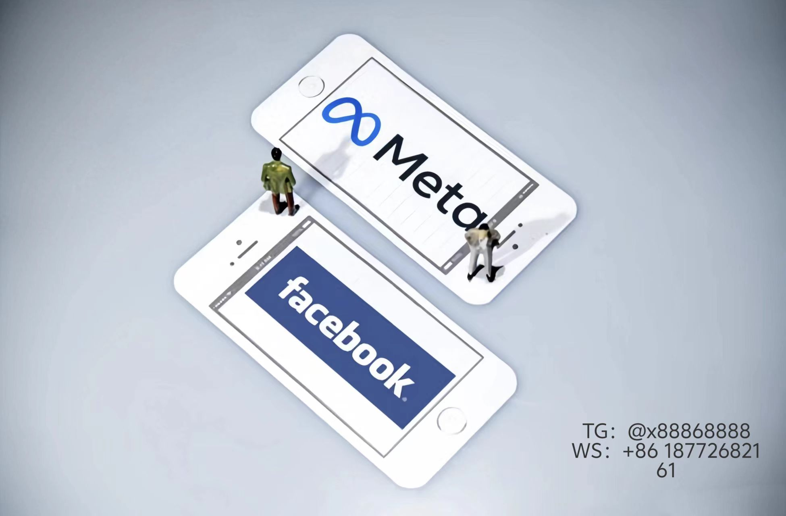

# Facebook广告运营实战指南
---
### **一、广告账号与前期准备**
1. **账号安全与养号**  
   - 使用真实个人信息注册，建议通过BM（商务管理平台）管理账号以降低封号风险。  
   - 新号需养号1-2周：每日登录点赞、评论，模拟真实用户行为，可借助自动化工具提升效率。  
2. **必备资源清单**  
   - **广告基础**：独立站链接、广告像素（用于追踪转化）、主页（需绑定商品）。  
   - **工具与物料**：广告预算（建议测试期每日$20起）、产品链接、高点击率素材（图片/视频）。  
---
### **二、广告创建全流程拆解**  
1. **确定投放目标**  
   - 明确目标：品牌曝光（Reach）或转化（Purchase），新手优先选择转化目标。  
2. **搭建广告架构**  
   - **广告系列（Campaign）**：选择目标（如流量、销售、互动）。  
   - **广告组（Ad Set）**：  
     - **受众定位**：按年龄/性别/兴趣筛选，或上传客户邮箱匹配相似用户（Lookalike Audience）。  
     - **版位选择**：自动版位覆盖Facebook/Instagram/ Audience Network，或手动排除低效渠道。  
     - **预算分配**：测试期建议使用“最低成本”策略，稳定后可切换“成本上限”。  
3. **素材设计与上传**  
   - **创意类型**：单图、轮播、全屏广告适合新品；视频广告（≤15秒）适合讲故事。  
   - **文案核心**：首行吸引注意力，突出折扣/功能痛点；CTA按钮（“立即购买”“限时优惠”）需明确。  
---
### **三、高效优化策略**  
1. **受众定向**  
   - **自定义受众**：上传独立站访客数据或客户邮箱，提高复购率。  
   - **兴趣扩展**：通过Google Keyword Planner挖掘关键词，反向定位竞品用户兴趣标签。  
2. **广告效果追踪**  
   - **关键指标**：关注CTR（点击率＞1%）、CPC（单次点击成本<$0.5）、ROAS（广告支出回报率≥2）。  
   - **A/B测试**：分批次测试素材/文案/受众，每次仅变动单一变量，72小时后淘汰低效组。  
3. **老客户激活**  
   - **再营销广告**：针对30天内加购未付款用户，推送优惠券或限时折扣。  
---

### **四、高阶运营工具与技巧**  
1. **工具推荐**  
   - **Power Editor**：批量管理广告，快速创建相似受众（Lookalike Audience）。  
   - **Ads Manager**：统一管理预算、版位、出价策略，支持数据报表导出分析。  
2. **素材制作**  
   - **设计原则**：背景干净、文案≤20%版面、产品占据视觉焦点；视频前3秒需出现核心卖点。  
   - **爆款案例**：家居用品多用场景化图片（如客厅布置）；服饰类主推模特动态展示。  
3. **预算分配技巧**  
   - 初期：80%预算用于表现最佳的广告组，20%测试新受众/素材。  
   - 稳定期：按时段分配，高峰时段（如用户活跃的20:00-22:00）增加预算权重。  
---
### **五、避坑指南**  
- **广告拒审**：避免使用“免费”“第一”等绝对化用语，禁用侵权图片。  
- **账号风控**：同一银行卡勿绑定多账号，新号前3月避免频繁更换IP。  
- **数据异常**：单日成本波动＞30%时暂停广告，检查是否触发自动化规则错误。  
---# Facebook1
